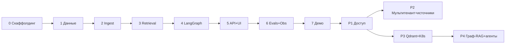

# PLAN — роадмап LYRA от нуля до production

Фазы **0–7 — MVP-трек** (результат показывается на собеседовании), **P1–P4 — production-трек**. Каждой MVP-фазе соответствует промпт `prompts/phase-NN-*.md` для генерации кода. Трудозатраты — оценка для одного разработчика с Claude Code (календарные дни неполной занятости).

Правила выполнения:
- Фаза закрывается только при выполненном Definition of Done (DoD); тесты и CI — часть DoD, не «потом».
- Изменения ключевых решений — только через новый/обновлённый ADR.
- С фазы 6 любое изменение промптов/retrieval/chunking проходит eval-гейт.

---

## MVP-трек

### Фаза 0 — Скаффолдинг и инфраструктура разработки
**Цель:** пустой, но запускающийся скелет всего стека одной командой.
**Объём:** монорепо (`backend/`, `frontend/`, `infra/`, `evals/`); FastAPI-приложение с /health, /metrics, структурными логами; React+Vite+TS болванка; docker-compose: api, worker, frontend, postgres(+pgvector), redis, ollama, tei-embeddings, tei-reranker; Makefile; GitHub Actions (lint ruff+mypy+eslint, pytest, vitest); pre-commit.
**Артефакты:** compose поднимает весь стек; CI зелёный на пустых тестах.
**DoD:** `docker compose up` → /health/ready показывает статус всех зависимостей; CI проходит; README с запуском.
**Зависимости:** — · **Оценка:** 2–3 дня · **Промпт:** [prompts/phase-00-scaffolding.md](prompts/phase-00-scaffolding.md)

### Фаза 1 — Модель данных и миграции
**Цель:** схема БД по [docs/data-model.md](docs/data-model.md) целиком (включая заделы tenant/ACL/eval).
**Объём:** SQLAlchemy-модели, Alembic-миграции (расширения vector/citext, HNSW/GIN-индексы), seed (tenant, admin, коллекция), репозитории (async) с tenant_id-параметром, JWT-auth + RBAC-dependency, эндпоинты /auth, /admin/users.
**DoD:** миграции up/down чистые; тесты репозиториев и RBAC-матрицы ([security-and-access.md §2](docs/security-and-access.md)) зелёные.
**Зависимости:** фаза 0 · **Оценка:** 3–4 дня · **Промпт:** [prompts/phase-01-data-model-and-migrations.md](prompts/phase-01-data-model-and-migrations.md)

### Фаза 2 — Ingest-пайплайн
**Цель:** асинхронный ingest файлов конец-в-конец + коннектор Confluence.
**Объём:** Celery (очереди ingest/sync/evals, beat, acks_late, retry) по [ADR-008](docs/adr/ADR-008-task-queue-celery-vs-rq.md); парсеры PDF/DOCX/MD/TXT → DocumentIR; chunking по [ADR-002](docs/adr/ADR-002-chunking-strategy.md)/[context-management.md](docs/context-management.md); secret-сканер (FR-6); EmbeddingClient (TEI, батчи, retry); индексация с версионированием и идемпотентностью ([data-model.md](docs/data-model.md)); `SourceConnector` + Confluence-реализация + MCP-обёртка ([ADR-010](docs/adr/ADR-010-connector-architecture-mcp.md)); API upload/jobs/sources ([api-contract.md §2](docs/api-contract.md)).
**DoD:** загрузка PDF → chunks с векторами в БД; повторная загрузка → skipped_duplicate; обновление → новая версия, старая скрыта; sync тестового Confluence-space работает инкрементально; секретный ключ в документе → failed_pii.
**Зависимости:** фаза 1 · **Оценка:** 5–7 дней · **Промпт:** [prompts/phase-02-ingest-pipeline.md](prompts/phase-02-ingest-pipeline.md)

### Фаза 3 — Retrieval: гибридный поиск + rerank
**Цель:** качественный поиск как самостоятельный слой с интерфейсом `VectorStore`.
**Объём:** интерфейсы VectorStore/Retriever/Fuser; PgVectorStore (HNSW) + BM25-канал (tsvector) параллельно; RRF k=60 ([ADR-005](docs/adr/ADR-005-hybrid-search-fusion.md)); RerankerClient + graceful degradation ([ADR-004](docs/adr/ADR-004-reranker.md)); дедупликация/MMR/склейка соседей ([context-management.md §3](docs/context-management.md)); Redis-кэш (embedding запроса, retrieval-результат); фильтры по метаданным + параметр access_context (задел ACL); POST /search.
**DoD:** /search возвращает результаты с разбивкой scores; отключение reranker-контейнера → degraded:true, поиск жив; юнит-тесты RRF/MMR детерминированные; smoke-замер latency в отчёт фазы.
**Зависимости:** фаза 2 · **Оценка:** 4–5 дней · **Промпт:** [prompts/phase-03-retrieval-hybrid-search.md](prompts/phase-03-retrieval-hybrid-search.md)

### Фаза 4 — LangGraph RAG-ядро
**Цель:** граф по [ADR-006](docs/adr/ADR-006-langgraph-topology.md) с цитатами по [ADR-007](docs/adr/ADR-007-citation-strategy.md).
**Объём:** LLMClient (Ollama: chat/stream/structured + трейсинг-обёртка, [ADR-009](docs/adr/ADR-009-llm-provider-abstraction.md)); state-модель; узлы condense_question, retrieve, grade_sufficiency (LLM+эвристики), corrective_retrieve (≤2), generate (стриминг, бюджет контекста по [context-management.md §2](docs/context-management.md)), cite (детерминированная валидация), self_check (≤1 retry), honest_fallback; confidence-агрегация; версионируемые промпты в файлах.
**DoD:** юнит-тесты каждого узла с фейковым LLM; интеграционные тесты 4 траекторий (happy, corrective, refusal, self-check-retry); ответ на вопрос по тестовому корпусу содержит валидные маркеры и citations; вопрос вне корпуса → refusal.
**Зависимости:** фаза 3 · **Оценка:** 5–7 дней · **Промпт:** [prompts/phase-04-langgraph-rag.md](prompts/phase-04-langgraph-rag.md)

### Фаза 5 — API чата и React UI
**Цель:** пользовательский продукт: чат со стримингом, цитатами, фидбеком, загрузкой.
**Объём:** /chat-эндпоинты с SSE по [api-contract.md §4](docs/api-contract.md) (status/token/final/error); история сессий; /feedback; rate limiting; React: чат (стриминг, маркеры [n] → сноски-popover с переходом к источнику, confidence-бейдж, refusal-состояние), страницы загрузки/jobs/sources, логин; Vitest-тесты ключевых компонентов.
**DoD:** сценарии UC-1, UC-2, UC-3, UC-4, UC-7 проходят вручную end-to-end; SSE-события соответствуют контракту; vitest зелёный.
**Зависимости:** фаза 4 · **Оценка:** 5–6 дней · **Промпт:** [prompts/phase-05-api-and-chat-ui.md](prompts/phase-05-api-and-chat-ui.md)

### Фаза 6 — Evals и наблюдаемость
**Цель:** доказуемое качество: eval-контур с гейтом в CI + полные метрики/трейсы.
**Объём:** evals-раннер по [eval-plan.md](docs/eval-plan.md) (метрики, judge-абстракция: локальный/облачный), CLI + Celery-задача + /admin/eval-runs; демо-корпус + golden dataset (50+ items, ручное ревью) в репозитории; thresholds.yaml + гейт и PR-отчёт в GitHub Actions; Prometheus-метрики по этапам пайплайна, Grafana-дашборд (provisioning), LLM-трейсы связаны trace_id.
**DoD:** eval-run воспроизводим и проходит пороги [PRD §6](docs/PRD.md); PR с намеренной порчей промпта краснеет; дашборд показывает latency-разбивку живого запроса.
**Зависимости:** фаза 5 (нужен полный пайплайн) · **Оценка:** 4–6 дней · **Промпт:** [prompts/phase-06-evals-and-observability.md](prompts/phase-06-evals-and-observability.md)

### Фаза 7 — Демо-упаковка и hardening
**Цель:** «собес-готовность»: чистый запуск с нуля, наполненное демо, отработанные сценарии.
**Объём:** make seed-demo (корпус + пользователи); прогон всех UC; нагрузочный смоук против NFR ([nfr.md](docs/nfr.md)) с фиксацией фактических p50/p95 в отчёт; security-гигиена (CORS, заголовки, non-root, pip-audit/npm-audit в CI); README с архитектурной диаграммой, скриншотами, замерами и «demo script» (последовательность показа: вопрос → цитаты → отказ → corrective в трейсе → eval-отчёт → Grafana).
**DoD:** чистая машина → работающее демо ≤ 15 мин; все eval-пороги зелёные; demo script отрепетирован.
**Зависимости:** фаза 6 · **Оценка:** 3–4 дня · **Промпт:** [prompts/phase-07-demo-hardening.md](prompts/phase-07-demo-hardening.md)

**Итого MVP: ~31–42 дня.** Линия собеседования: после фазы 7 показывается продукт (чат с цитатами и честными отказами), инженерия (ADR, тесты, CI, наблюдаемость) и качество (eval-отчёты).

---

## Production-трек

Обзорный промпт трека: [prompts/phase-08-production-track.md](prompts/phase-08-production-track.md). Каждая P-фаза перед стартом получает детальный промпт по образцу MVP-фаз.

### P1 — Доступ уровня предприятия
**Объём:** OIDC/SSO; enforcement doc-level ACL (наследование прав Confluence, фильтр до ранжирования — [security-and-access.md §3](docs/security-and-access.md)); PII-политики (NER) при ingest; append-only аудит.
**DoD:** пользователь не видит документ без прав ни в ответах, ни в citations, ни в nearest_documents; тесты на утечки через все пути выдачи. **Оценка:** 2–3 недели.

### P2 — Мультитенантность и новые источники
**Объём:** RLS по tenant_id, tenant в JWT, tenant-scoped кэш; онбординг tenant; коннекторы Notion и Google Drive по контракту `SourceConnector`; near-duplicate дедупликация корпуса.
**DoD:** два tenant на одном стенде без пересечений (тесты изоляции, включая кэш); новый коннектор добавляется без изменений пайплайна. **Оценка:** 3–4 недели. **Зависимости:** P1.

### P3 — Масштабирование: Qdrant, K8s, автоскейл
**Объём:** QdrantVectorStore + backfill-миграция + двойная запись на переходе ([ADR-001](docs/adr/ADR-001-vector-store-pgvector-vs-qdrant.md)); Helm-чарты, HPA воркеров и инференса (GPU-пул), managed PG, Redis Sentinel; облачный LLM как опция LLMClient; SLO-алертинг; нагрузочные тесты до целевых NFR-prod ([nfr.md](docs/nfr.md)).
**DoD:** прогон на 1M+ chunks с NFR-prod latency; отказ узла не роняет сервис; eval-метрики не деградировали после миграции хранилища. **Оценка:** 4–6 недель. **Зависимости:** P1 (независим от P2, можно параллельно).

### P4 — Качество следующего уровня: граф-RAG и агентный поиск
**Объём:** граф сущностей/связей поверх корпуса как доп. канал retrieval; агентный мульти-source поиск (LangGraph-агент с MCP-инструментами: живой Confluence/Notion + индекс); online-eval контур (canary-промпты, автосбор датасета из фидбека); learned sparse (bge-m3) как третий канал fusion.
**DoD:** A/B на eval-датасете: новые каналы дают статистически значимый прирост recall/faithfulness, иначе не включаются. **Оценка:** 4–8 недель (исследовательская). **Зависимости:** P3.

---

## Карта зависимостей

