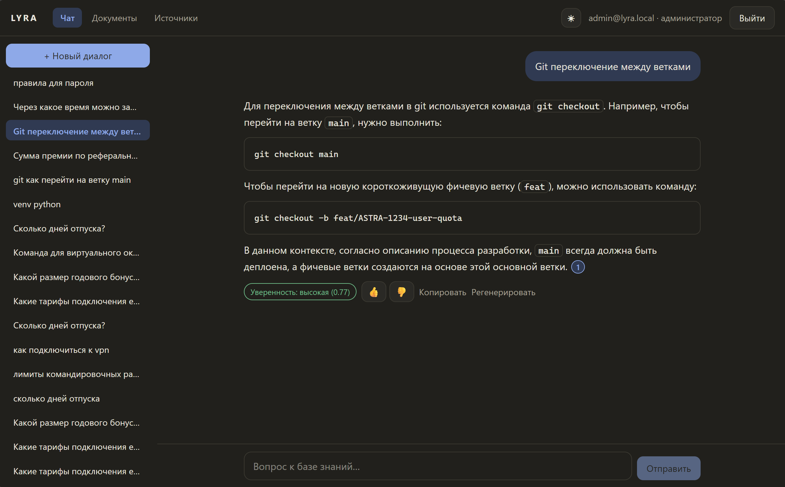
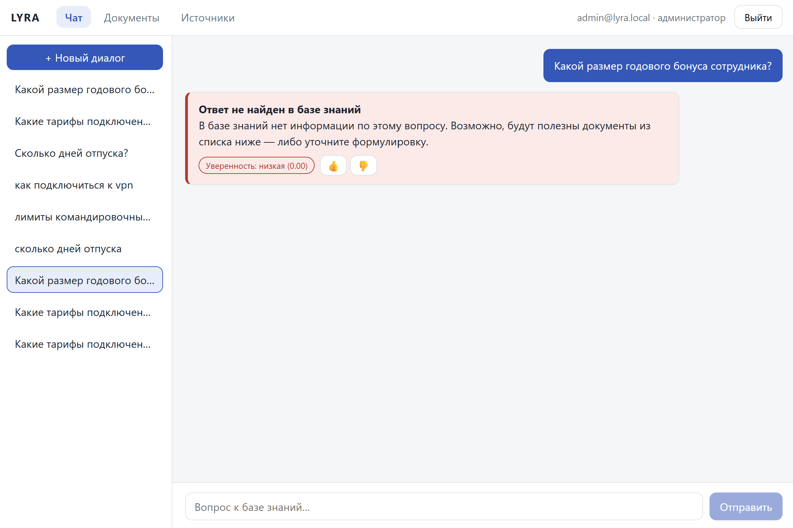
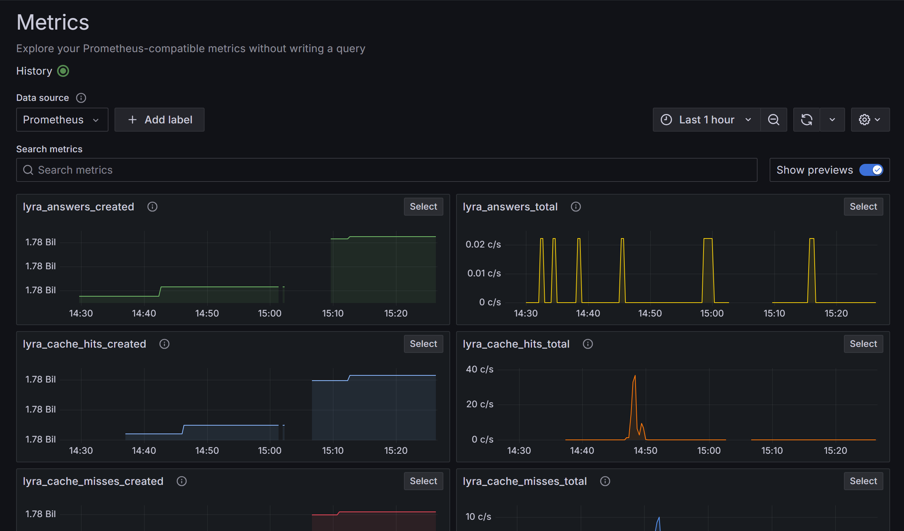
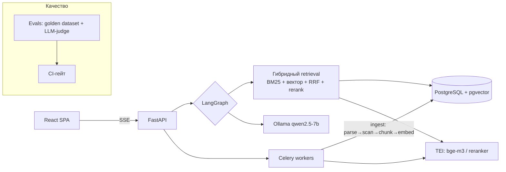

# LYRA — Гармония знаний

[](https://github.com/axrmxv/lyra/actions/workflows/ci.yml)
[](https://github.com/axrmxv/lyra/actions/workflows/eval.yml)

RAG-платформа корпоративных знаний — портфолио-кейс production-мышления:
чат по внутренним документам с **обязательными проверяемыми цитатами**,
честными отказами вместо галлюцинаций и измеримым качеством (eval-гейт в CI).
Полностью self-hosted: Ollama (Qwen2.5-7B), bge-m3, bge-reranker-v2-m3 —
данные не покидают контур.

## Скриншоты

| Ответ с цитатами | Честный отказ | Grafana |
|---|---|---|
|  |  |  |

## Архитектура



Граф ответа: condense → retrieve → **grade_sufficiency** → (corrective ≤2) →
generate → **cite** → **self_check** → ответ | **честный отказ**. Фактологический
ответ без валидных маркеров `[n]` не выпускается (ADR-006/007).

## Quick start

Требования: Docker Desktop, 16 ГБ RAM (Windows/WSL2 — **обязателен**
`.wslconfig` с `memory=12GB`, `swap=8GB`, иначе ML-сервисы гибнут по OOM),
~20 ГБ диска под модели.

```bash
cp .env.example .env   # заполнить пароли
make up                # стек + модели (первый запуск качает ~8 ГБ)
make seed-demo         # корпус, витринные документы, demo-пользователи
```

UI: http://localhost:5173 · API: http://localhost:8000 · Grafana: http://localhost:3000.
Регресс-проверка перед показом: `python scripts/demo_smoke.py` (UC-1..UC-9,
таблица PASS/FAIL). Сценарий показа — [docs/demo-script.md](docs/demo-script.md).

## Качество и производительность

Метрики считает eval-контур: `make eval` — 55 items golden dataset, LLM-judge,
пороги в [evals/thresholds.yaml](evals/thresholds.yaml), baseline-регресс > 0.05
валит CI. Фактические метрики последнего run и замеры latency —
[docs/nfr-actual.md](docs/nfr-actual.md). На CPU-ноутбуке: chat p50 — минуты
(prompt eval 16k контекста), search с rerank ~9–10 с; на GPU — секунды без
изменения кода ([docs/nfr.md](docs/nfr.md)).

## Документация

- [PRD](docs/PRD.md) · [Архитектура](docs/architecture.md) · [Модель данных](docs/data-model.md)
- [API-контракт](docs/api-contract.md) · [Chunking и контекст](docs/context-management.md)
- [План качества (evals)](docs/eval-plan.md) · [Безопасность](docs/security-and-access.md) · [NFR](docs/nfr.md)
- Решения: [docs/adr/](docs/adr/) — ADR-001..010 (pgvector, гибридный поиск,
  топология графа, цитирование, Celery, LLM-абстракция, коннекторы)

## Наблюдаемость

Prometheus (http://localhost:9090) + Grafana-дашборд «LYRA — обзор»:
latency по узлам графа, RPS и доля отказов, ingest, токены, размер индекса.
LLM-трейсы — структурные логи внутри контура (наружу не отправляются,
docs/security-and-access.md §5). Трейс запроса по trace_id:

```bash
docker logs lyra-api-1 2>&1 | grep '"llm_call"' \
  | jq -r 'select(.trace_id=="tr_...") | [.node,.model,.prompt_tokens,.completion_tokens,.duration_ms] | @tsv'
```

## Онбординг разработчика

`pre-commit install && pre-commit install --hook-type commit-msg` — обязательный
шаг (ruff, prettier, gitleaks, commitlint). Команды: `make test / lint / eval`.
Правила кода — `.claude/rules/`, инварианты проекта — `.claude/CLAUDE.md`.
