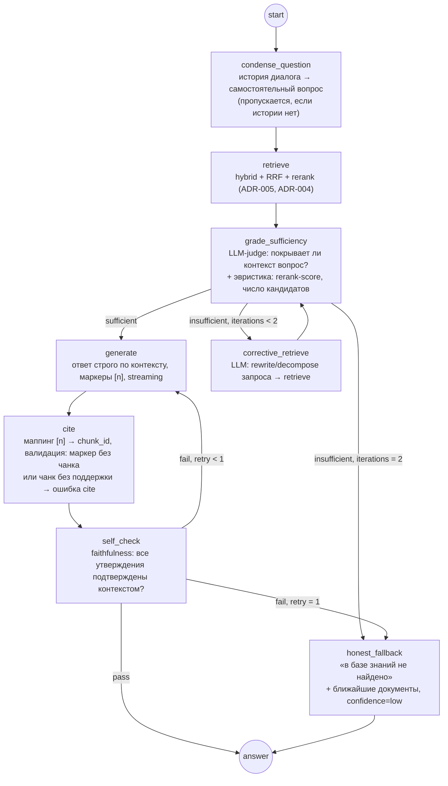

# ADR-006: Топология LangGraph

**Статус:** принято · **Дата:** 2026-07-08

## Контекст

«Тонкий» RAG (retrieve → generate) галлюцинирует, когда retrieval вернул нерелевантный или неполный контекст: LLM всё равно отвечает. Требование продукта — проверяемые ответы и честный отказ ([PRD](../PRD.md) FR-8, FR-9, UC-2). Нужна топология графа с проверкой достаточности контекста, корректирующим retrieval и самопроверкой ответа. Оркестратор зафиксирован стеком — LangGraph.

## Варианты

| Критерий | Тонкий RAG (retrieve→generate) | Self-RAG/CRAG-гибрид: sufficiency + corrective + self-check (выбран) | Полный агентный цикл (ReAct, planner, multi-tool) |
|----------|-------------------------------|--------------------------------------------------------------------|---------------------------------------------------|
| Устойчивость к плохому retrieval | ❌ Галлюцинации | ✅ Grading + переформулировка + честный отказ | ✅ |
| Латентность / стоимость | ✅ 1 LLM-вызов | ⚠️ 3–4 LLM-вызова обычно, до 10 в худшем случае (частично мелких) | ❌ Непредсказуемо много |
| Предсказуемость и тестируемость | ✅ | ✅ Фиксированный граф, ограниченные циклы | ❌ Трудно тестировать, недетерминированные траектории |
| Соответствие цели портфолио | ❌ Не показывает управление контекстом | ✅ Демонстрирует self-RAG/CRAG паттерны | ⚠️ Эффектно, но хрупко на локальной 7B-модели |
| Когда применять | Прототип, идеальный корпус | Production-RAG с требованием достоверности | Мульти-source агентные задачи (наш production-трек P4) |

## Решение

Гибрид Self-RAG + Corrective RAG с фиксированной топологией и жёстко ограниченными циклами:

### Контракт state (Pydantic-модель, единственный способ передачи данных между узлами)

| Поле | Тип | Кто пишет |
|------|-----|-----------|
| `question`, `chat_history` | str, list | вход |
| `condensed_question` | str | condense_question |
| `retrieved_chunks` | list[ScoredChunk] | retrieve / corrective_retrieve |
| `sufficiency` | {verdict, score, missing_aspects} | grade_sufficiency |
| `corrective_iterations` | int (0–2) | corrective_retrieve |
| `draft_answer` | str | generate |
| `citations` | list[Citation] | cite |
| `self_check` | {passed, unsupported_claims} | self_check |
| `generate_retries` | int (0–1) | generate |
| `final` | AnswerPayload (answer/refusal + citations + confidence) | OUT/REFUSE |

### Принципы

- **Узлы — чистые функции над state:** никакого I/O вне переданных зависимостей (retriever, llm_client); побочные эффекты (аудит, метрики) — в обвязке графа, не в узлах. Это делает каждый узел юнит-тестируемым с фейковым LLM.
- **Циклы жёстко ограничены:** ≤2 corrective-итерации, ≤1 регенерация. Худший случай — конечное число LLM-вызовов, латентность предсказуема ([nfr.md](../nfr.md)).
- **grade_sufficiency = LLM-judge (лёгкий промпт, structured output) + эвристики** (max rerank-score ниже порога или <3 кандидатов → insufficient без траты LLM-вызова).
- **Confidence** финального ответа агрегируется из sufficiency.score, среднего rerank-score процитированных chunks и результата self_check ([ADR-007](ADR-007-citation-strategy.md)).
- Каждый узел пишет запись в LLM-трейс (trace_id, узел, промпт, токены, длительность) — FR-19.

## Последствия

- (+) Выполняет главные анти-требования: нет генерации без достаточного контекста, честный отказ — полноценная ветка графа, а не исключение.
- (+) Топология фиксирована → воспроизводимые тесты: юнит на каждый узел, интеграционные на траектории (happy path, corrective loop, refusal, self-check retry).
- (−) До 10 LLM-вызовов в худшем случае (condense + grade×3 + rewrite×2 + generate×2 + self_check×2), обычно 3–4: эвристики grade экономят вызовы, condense пропускается без истории. p95 честно отражён в NFR; смягчение: grading-вызовы короткие, кэш retrieval, эвристики до LLM-judge.
- (−) Качество grading на 7B-модели ограничено — пороги эвристик страхуют; калибровка grade_sufficiency входит в eval-план ([eval-plan.md](../eval-plan.md)).
