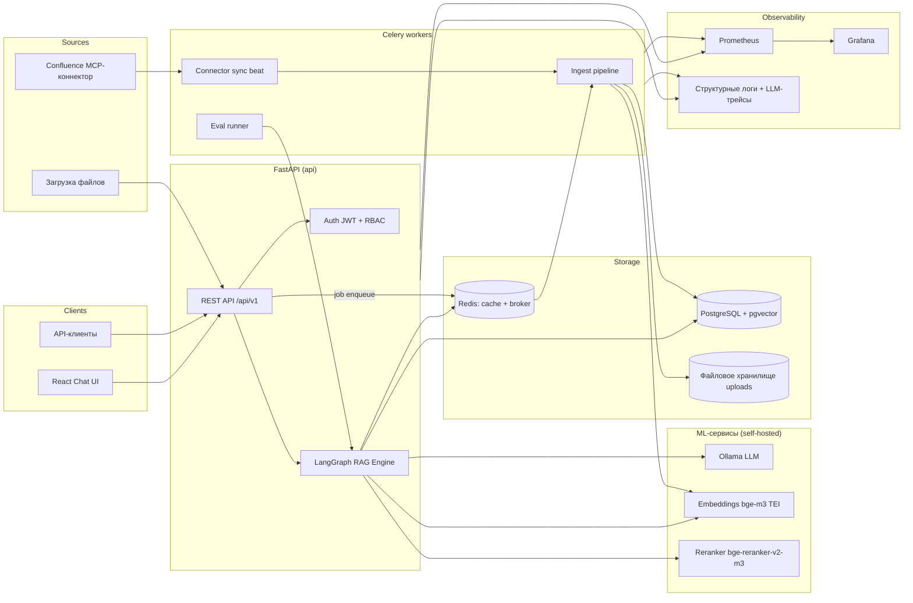
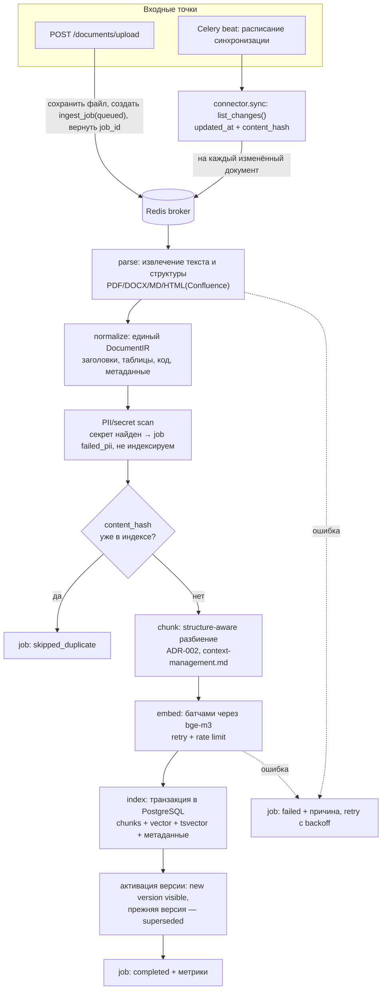
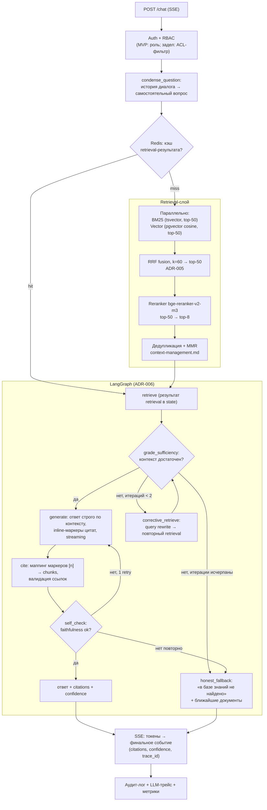

# Архитектура — LYRA

Документ описывает компоненты системы, их ответственность, потоки данных (ingest и query), точки отказа и границу между MVP и target-архитектурой.

Связанные ADR: [ADR-001 (vector store)](adr/ADR-001-vector-store-pgvector-vs-qdrant.md), [ADR-005 (fusion)](adr/ADR-005-hybrid-search-fusion.md), [ADR-006 (LangGraph)](adr/ADR-006-langgraph-topology.md), [ADR-008 (очередь задач)](adr/ADR-008-task-queue-celery-vs-rq.md), [ADR-009 (LLM)](adr/ADR-009-llm-provider-abstraction.md), [ADR-010 (коннекторы)](adr/ADR-010-connector-architecture-mcp.md).

---

## 1. Обзор компонентов

### Ответственность компонентов

| Компонент | Ответственность | Не отвечает за |
|-----------|-----------------|----------------|
| **React Chat UI** | Диалог, стриминг ответа, отображение цитат и confidence, фидбек, загрузка документов, статусы jobs | Бизнес-логику; вся логика на бэкенде |
| **FastAPI REST** | Контракт API, валидация (Pydantic v2), auth/RBAC, SSE-стриминг, постановка ingest-задач в очередь | Тяжёлую работу (парсинг, эмбеддинг) — всё в workers |
| **LangGraph RAG Engine** | Оркестрация query-пайплайна: retrieve → sufficiency → corrective → generate → cite → self-check; управление state | Хранение данных; доступ через репозитории |
| **Retrieval-слой** | Гибридный поиск (BM25 + вектор), RRF-fusion, вызов reranker, фильтры по метаданным; интерфейс `VectorStore` — точка миграции на Qdrant | Генерацию |
| **Celery workers** | Асинхронный ingest (parse/normalize/chunk/embed/index), периодическая синхронизация Confluence (beat), запуск evals | Обработку пользовательских запросов в реальном времени |
| **Коннекторы (`SourceConnector`)** | Получение и нормализация документов из источников, инкрементальность, идемпотентность | Chunking/embedding — общий пайплайн |
| **Ollama** | Инференс LLM (генерация, grading, query rewrite) | — |
| **Embeddings-сервис (TEI, bge-m3)** | Векторизация chunks и запросов | — |
| **Reranker-сервис** | Cross-encoder переранжирование top-N кандидатов | — |
| **PostgreSQL + pgvector** | Все реляционные данные + векторный индекс + full-text (tsvector) — единый источник истины MVP | — |
| **Redis** | Кэш (эмбеддинги запросов, ответы поиска), брокер Celery, rate limiting | Долговременное хранение |
| **Prometheus/Grafana/логи** | Метрики, дашборды, структурные логи, трейсинг LLM-вызовов | — |

---

## 2. Ingest-пайплайн

Всегда асинхронный (антипаттерн — синхронный ingest в HTTP-запросе). API только валидирует и ставит задачу.

Ключевые свойства:

- **Идемпотентность:** `content_hash` (SHA-256 нормализованного содержимого) проверяется до chunking; повторная загрузка — no-op (`skipped_duplicate`). Уникальный ключ `(source_id, external_id, content_hash)`.
- **Версионирование:** новая версия документа индексируется рядом со старой, затем атомарным UPDATE переключается видимость (`documents.active_version`); откат возможен. Старые chunks удаляются отложенно (garbage collection задачей).
- **Транзакционность:** chunks + векторы + tsvector пишутся в одной транзакции PostgreSQL — преимущество pgvector в MVP ([ADR-001](adr/ADR-001-vector-store-pgvector-vs-qdrant.md)).
- **Наблюдаемость:** каждый шаг обновляет `ingest_jobs.status`; метрики: длительность шага, размер очереди, ошибки по типам.

---

## 3. Query-пайплайн

Бюджет контекста, дедупликация и обработка длинных документов — [context-management.md](context-management.md). Формат ответа — [api-contract.md](api-contract.md).

---

## 4. Точки отказа и деградация

| Отказ | Поведение MVP | Production-цель |
|-------|---------------|-----------------|
| **Ollama недоступен / таймаут** | Честная ошибка 503 «модель недоступна» + retry с backoff на 1 повтор; никакой генерации без модели | Реплики инференса, failover на облачный API через `LLMClient` |
| **Embeddings-сервис недоступен** | Query: fallback на чистый BM25 с пометкой degraded в ответе; Ingest: retry, job остаётся queued | Реплики TEI, HPA |
| **Reranker недоступен** | Graceful degradation: используется RRF-порядок без reranking, флаг degraded в трейсе | Реплики |
| **Redis недоступен** | Кэш пропускается (запросы медленнее); Celery-задачи не принимаются — ingest временно недоступен, API отвечает 503 на upload | Redis Sentinel/кластер |
| **PostgreSQL недоступен** | Полный отказ (единый источник истины) — 503 | Managed PG / Patroni, реплики чтения |
| **Celery worker умер посреди задачи** | acks_late + идемпотентность шагов: задача перевыполняется без дубликатов | Autoscale workers, DLQ |
| **Confluence API недоступен/лимиты** | Синхронизация переносится на следующий тик beat; экспоненциальный backoff; алерт при N подряд неудач | — |
| **Переполнение контекста LLM** | Жёсткий бюджет токенов до вызова ([context-management.md](context-management.md)); усечение по приоритету rerank-score | — |
| **Провал self-check** | 1 регенерация → честный отказ; инцидент виден в метрике | Автоматический сбор таких случаев в eval-датасет |

---

## 5. Граница MVP vs Target

| Аспект | MVP (docker-compose) | Target (production) |
|--------|----------------------|---------------------|
| Векторное хранилище | pgvector в основной PG | Qdrant (критерии перехода в [ADR-001](adr/ADR-001-vector-store-pgvector-vs-qdrant.md)) |
| LLM | Ollama локально (Qwen2.5-instruct) | Облачный API (Claude/GPT) или GPU-кластер, за тем же `LLMClient` |
| Источники | Файлы + Confluence | + Notion, Google Drive, диски; каталог MCP-коннекторов |
| Доступ | JWT, RBAC на эндпоинты | SSO/OIDC, ACL на уровне документов при retrieval, аудит-экспорт |
| Тенантность | Один tenant (`tenant_id` в схеме) | Полная изоляция per-tenant (RLS / отдельные коллекции) |
| Развёртывание | docker-compose | Kubernetes, HPA для workers и ML-сервисов, Helm |
| Очередь | Celery + Redis, 1 worker | Пулы воркеров по типам задач, приоритетные очереди, DLQ |
| Retrieval | Hybrid + rerank | + граф-RAG, агентный мульти-source поиск, tuned fusion |
| Evals | Offline в CI | + Online-мониторинг качества, canary-промпты, автосбор датасета из фидбека |
| Наблюдаемость | Prometheus + Grafana + логи + LLM-трейсы | + OpenTelemetry end-to-end, алертинг, SLO-дашборды |

Роадмап перехода — [PLAN.md](../PLAN.md).
