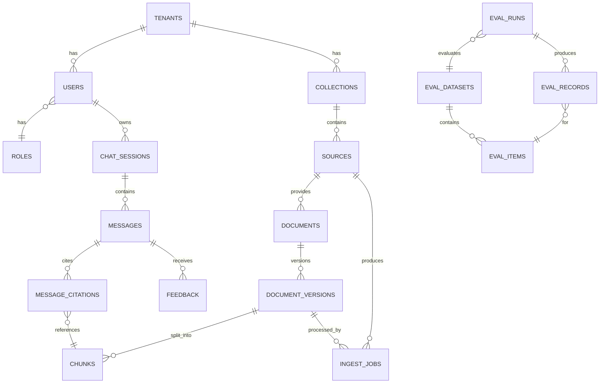

# Модель данных — LYRA

PostgreSQL — единый источник истины MVP (реляционные данные + pgvector + tsvector, [ADR-001](adr/ADR-001-vector-store-pgvector-vs-qdrant.md)). ORM — SQLAlchemy 2.0 async, миграции — Alembic.

---

## 1. ER-диаграмма



## 2. Сущности

Все таблицы: `id UUID PK (uuid7)`, `created_at`, `updated_at`. Все доменные таблицы несут `tenant_id UUID NOT NULL` (MVP: единственный seed-tenant; enforcement выключен — задел мультитенантности, [security-and-access.md](security-and-access.md)).

### tenants (задел)
| Поле | Тип | Примечание |
|------|-----|------------|
| name | text | |
| status | enum(active, suspended) | |

### users / roles
| users | Тип | Примечание |
|------|-----|------------|
| email | citext unique | |
| password_hash | text | argon2 |
| role | enum(admin, editor, viewer) | MVP: роль-поле; отдельная таблица ролей/прав — production при появлении кастомных ролей |
| is_active | bool | |

### collections
Логическая группа знаний (например «Внутренняя документация»), единица настройки retrieval.
| Поле | Тип | Примечание |
|------|-----|------------|
| name, description | text | |
| embedding_model | text | контракт индекса: имя+версия модели ([ADR-003](adr/ADR-003-embedding-model.md)); смена → переиндексация |
| chunking_config | jsonb | параметры из [context-management.md](context-management.md) |

### sources
| Поле | Тип | Примечание |
|------|-----|------------|
| collection_id | FK | |
| type | enum(upload, confluence, notion, gdrive) | notion/gdrive — задел |
| config | jsonb | url, spaces; секреты — НЕ здесь, только ссылка на env-ключ |
| sync_cursor | jsonb | инкрементальность ([ADR-010](adr/ADR-010-connector-architecture-mcp.md)) |
| sync_schedule | text (cron) | для beat |
| status | enum(active, paused, error) | |

### documents
Логический документ (страница Confluence, загруженный файл).
| Поле | Тип | Примечание |
|------|-----|------------|
| source_id | FK | |
| external_id | text | id страницы / имя+путь файла; **unique (source_id, external_id)** |
| title, url, author | text | |
| active_version_id | FK → document_versions, nullable | атомарное переключение видимой версии |
| status | enum(active, deleted) | soft delete от коннектора |

### document_versions
| Поле | Тип | Примечание |
|------|-----|------------|
| document_id | FK | |
| version | int | монотонный |
| content_hash | text | SHA-256 нормализованного содержимого; **unique (document_id, content_hash)** — идемпотентность |
| source_updated_at | timestamptz | свежесть источника |
| meta | jsonb | язык, число страниц, mime |
| status | enum(indexing, active, superseded, failed) | |

### chunks
| Поле | Тип | Примечание |
|------|-----|------------|
| document_version_id | FK | |
| tenant_id, collection_id | UUID | денормализация для фильтров поиска без JOIN |
| ordinal | int | порядок в документе |
| text | text | то, что идёт в контекст LLM |
| embedding | vector(1024) | bge-m3; HNSW-индекс (cosine) |
| tsv | tsvector | GENERATED из text, конфигурация russian+english; GIN-индекс |
| token_count | int | для бюджета контекста |
| metadata | jsonb | схема ниже; GIN-индекс |

**Схема `chunks.metadata`** (контракт фильтрации retrieval):
```json
{
  "source_type": "confluence | upload",
  "doc_title": "...",
  "headings_path": ["H1", "H2"],
  "block_type": "text | table | code",
  "lang": "ru | en",
  "url": "...",
  "source_updated_at": "2026-07-01T00:00:00Z",
  "acl": {"allowed_roles": [], "allowed_users": []}   // задел, в MVP пусто = виден всем
}
```
Видимость при поиске: JOIN на `document_versions.status='active'` — только активные версии попадают в выдачу (и в BM25, и в вектор).

### ingest_jobs
| Поле | Тип | Примечание |
|------|-----|------------|
| source_id, document_version_id | FK nullable | |
| kind | enum(upload, sync, reindex) | |
| status | enum(queued, processing, completed, failed, failed_pii, skipped_duplicate) | FR-2, FR-3, FR-6 |
| steps | jsonb | таймстемпы и длительности parse/chunk/embed/index |
| error | text | |
| celery_task_id | text | |

### chat_sessions / messages / message_citations / feedback
| messages | Тип | Примечание |
|------|-----|------------|
| session_id | FK | |
| role | enum(user, assistant) | |
| content | text | текст с маркерами [n] |
| confidence | jsonb {label, score} | [ADR-007](adr/ADR-007-citation-strategy.md) |
| trace_id | text | связь с LLM-трейсом |
| graph_meta | jsonb | итерации corrective, вердикты sufficiency/self_check, degraded-флаги — аудит и отладка |

`message_citations`: message_id FK, chunk_id FK, marker int, quote text, relevance_score float.
`feedback`: message_id FK, user_id FK, rating enum(up, down), comment text — вход eval-контура (FR-16).

### eval_datasets / eval_items / eval_runs / eval_records
| eval_items | Тип | Примечание |
|------|-----|------------|
| dataset_id | FK | |
| question | text | |
| ground_truth_answer | text nullable | |
| expected_chunk_ids / expected_doc_ids | jsonb | для context recall |
| kind | enum(answerable, unanswerable, paraphrase) | negative set и paraphrase-подмножество ([eval-plan.md](eval-plan.md)) |

`eval_runs`: dataset_id, git_ref, config_snapshot jsonb (модель, промпты-версии, retrieval-параметры), status, aggregate jsonb (метрики). `eval_records`: run_id, item_id, answer, citations, метрики per-item, judge_raw jsonb.

## 3. Связи и инварианты

- Документ виден в поиске ⇔ `documents.status='active'` И `active_version_id` указывает на версию со `status='active'`.
- Переключение версии — одна транзакция: новая версия `active`, прежняя `superseded`, `documents.active_version_id` обновлён. Chunks superseded-версий чистит фоновая GC-задача (отложенно, чтобы не рвать открытые цитаты).
- Уникальность `(document_id, content_hash)` — вторая загрузка того же содержимого завершает job как `skipped_duplicate` до эмбеддинга.
- Каждая citation ссылается на реальный chunk — FK; удаление chunks GC-задачей ставит `ON DELETE SET NULL` и сохраняет quote-текст в citation (история читаема после чистки).

## 4. Индексы (ключевые)

| Индекс | Назначение |
|--------|------------|
| chunks: HNSW (embedding vector_cosine_ops) | ANN-поиск |
| chunks: GIN (tsv) | BM25-канал |
| chunks: GIN (metadata jsonb_path_ops), btree (collection_id) | фильтры |
| document_versions: unique (document_id, content_hash) | идемпотентность |
| documents: unique (source_id, external_id) | ключ коннектора |
| messages: btree (session_id, created_at) | история |

## 5. Миграции

- Alembic, только автогенерация + ручная проверка; `alembic upgrade head` — шаг entrypoint API-контейнера.
- Первая миграция включает расширения (`vector`, `citext`) и seed: tenant, admin-пользователь, дефолтная collection.
- Векторная размерность зашита в тип колонки — смена embedding-модели с другой размерностью = новая таблица chunks + переиндексация (процедура в [PLAN.md](../PLAN.md), не «миграция на живую»).
- Правило: миграции обратимы (downgrade пишется), кроме явно помеченных data-миграций.
